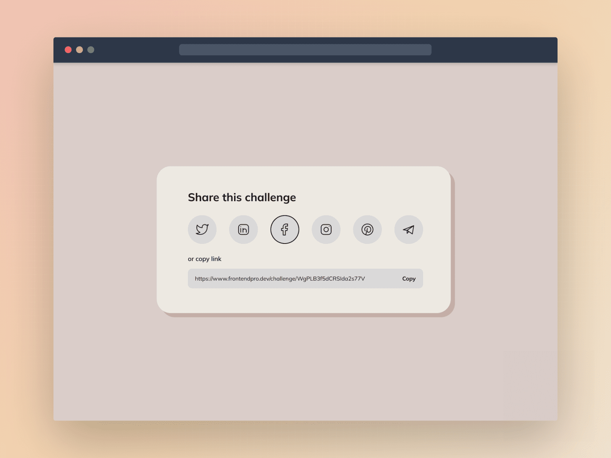

**Challenge Title**
Share Content Card Component

**Challenge Description**
In this frontend challenge, you'll build a Share Content Card Component. This challenge is perfect for you if you've been learning CSS and JavaScript and are looking to practice what you've learned by building something new and beginner-friendly.

**Difficulty Level**
Beginner

**Tags**
FRONTEND

**Learning**
In this frontend challenge, you'll learn how to build interactive UI components using CSS and JavaScript. You will learn to use CSS flexbox or grid to create responsive UI components. Additionally, you will also learn to implement copy-to-clipboard functionality.

**Requirements**

- The component should allow users to share content on various social media platforms, such as Facebook, Twitter, and Instagram.
- The component must include a "Copy" button that allows users to copy the shared link to their clipboard.
- The component should be responsive and display correctly on different screen sizes.
- Make this Share Content Card Component look as close to the design as possible.

I hope you'll enjoy building this challenge.

Feel free to share your solution on the website or on social media and tag [us](https://twitter.com/FrontendProHQ).
